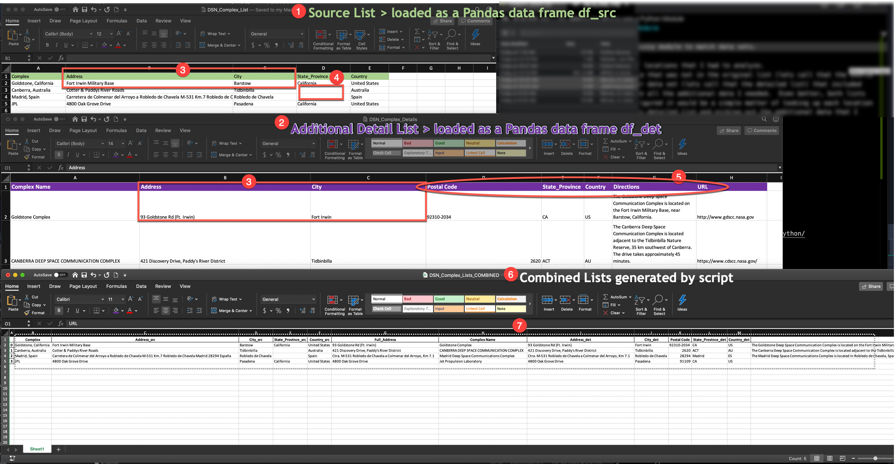
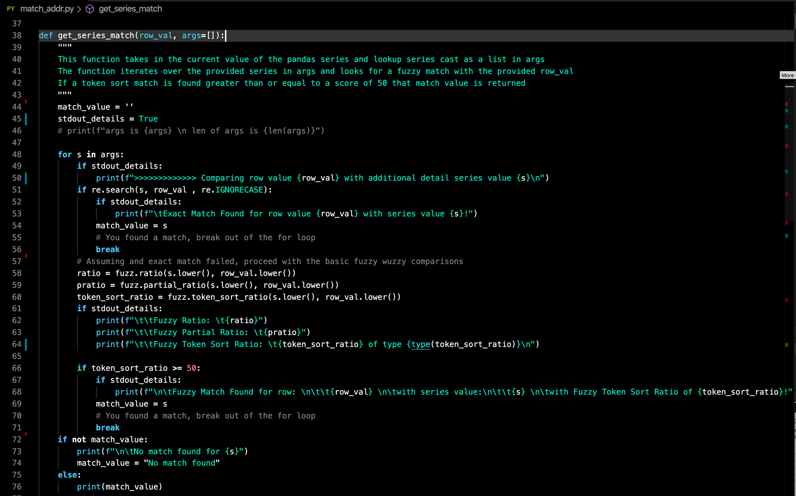

# FuzzyWuzzy was a Python Module

## An example of using the fuzzywuzzy module to match data sets with similar but not exact data

I was recently given a list of locations that I had to analyze.

For the analysis, I needed data that was not in the original list (lets call that the source list).   Luckily I had a larger data set (lets call that the detail list) which did have all the additional details I needed.  

The source list with locations was a subset of the detail list.  Even better, both lists had an "Address" column so I figured it would be a simple matter of looking up each location in my source list in the larger detail list and picking out the additional data that I needed.

...or so I thought...

As I drilled down into the actual data, what I saw immediately derailed my original plan to use the "Address" column in both data sets as the key to match.  For that to work, the keys would need to be the same or nearly so but I saw drastically different data.  I might have been able to account for spaces and capitalization differences but never something like this:

| Value From Source List Address | Value From Detailed List Address |
| ------------------------------ | -------------------------------- |
| Fort Irwin Military Base       | 93 Goldstone Rd (Ft. Irwin)      |

As ever, Google to the rescue and enter the **[fuzzywuzzy](https://pypi.org/project/fuzzywuzzy/)** python module.

## The Same Column but NOT the Same Data

Lets look at the data first.

I've used a list of [NASA's Deep Space Network](https://deepspace.jpl.nasa.gov/) Complexes to simulate the data and issues I had.  My actual source list had hundreds of locations and the details list had thousands.

Numbers correspond to the image below.

1. This is the original source list containing the list of locations to be analyzed. 
2. I happened to have the additional detail file which had all the additional information I needed for the locations listed in the original source list.
3. At first look it seemed a perfect match as both files had an "Address" column I could use as a "key" to get the additional information for the locations in my original source list.  However, on closer inspection you can see that the addresses for the same location were quite different.  Even the "City" column had differences.
4. You can also see that the source list was missing some State data.
5. Finally, for each location in my source list I needed ZIP, complete state data, 2 Letter Country code, Directions, and the URL for each location.
6. What I needed was all of the data in #5 extracted from the much larger detail file and combined with the locations from my original list.  



7. For those that like to flip to the end, the script we will discuss here provided the last file combining the source list of locations with the detail data for each location from the larger detail file.


## The Main section of the script

I've put the sample data sets and the script [here on GitHub](https://github.com/cldeluna/fuzzy_wuzzy_examples).

The main body of the script is very simple thanks to [Pandas](https://pypi.org/project/pandas/) (another wonderful python module).  It's really only 8 lines of code and 4 steps.

- Load the data sets from the Excel files into Pandas Data Frames

```python
# Create a Data Frame from the Source Excel File
df_src = df_from_excel(arguments.source_file)
# Create a Data Frame from the Additional Details Excel File
df_det = df_from_excel(arguments.detail_file)
```

- Add a new column to the source data set for "Full_Address" which contains the address information from the detailed file.  This allows us to use the Pandas merge function to merge the two data sets in one line in exactly the way we want.  This one statement calls a function that performs the fuzzy lookups

```python
# Add a new column "Full_Address" to the Source data frame which has the "Address" information form the additional details data frame
# This new column will be used in the Pandas merge 
df_src['Full_Address'] = df_src['Address'].apply(get_series_match, args=[df_det['Address']])
```

- Merge the two Data Frames into one data set with all the information needed

```python
# Merge the two data frames
df_merged = pd.merge(df_src, df_det, left_on="Full_Address", right_on="Address", how="left", suffixes=('_src', '_det'))
```


- Save the merged Data Frame as an Excel file and as a JSON file.

```python
# Save output to an Excel file
all_data_fn = "DSN_Complex_Lists_COMBINED"

df_merged.to_excel(f"{all_data_fn}.xlsx")
df_merged.to_json(f"{all_data_fn}.json", orient="records")
```

That is an overview of the entire process.

------

## The get_series_match Function

The real magic is in the **get_series_match** function that is used to build the new "Full_Address" column in the original data set, **df_src**.  

Let's take a closer look at what that function is doing.

First, lets remember how its called:

```python
df_src['Full_Address'] = df_src['Address'].apply(get_series_match, args=[df_det['Address']])
```

To the left of the equal sign, we tell the **df_src** data frame that we want to add a new column, "Full_Address".   We build the contents of that new column by passing the "Address" value from the source data frame, **df_src['Address']**, and using Pandas "apply" method to build the new value of each row using the **get_series_match** function (and we pass to the function the column "Address" data from the details data frame, **df_det['Address']**).  

In this one statement, thanks to the power of Pandas, we can iterate over the values in the Address column of the source data frame **df_src['Address']**, sending each to the **get_series_match** function to search for a match in the detail data frame Address column.

I will be the first to admit this is in no way elegant or "pythonic" but I'm not a developer. I'm a network engineer.  It works!



**In line 38** we see the function defined with the two values it expected to be passed to it when called.  The variable **row_val** has the "cell" value from the source data frame "Address" column.

**Line 44** sets an empty variable to hold the **match value** (the address from the detail data frame).

The **args** variable is defined as a list and it has the column values from the detail data frame "Address" column so that we can iterate through that list looking for the specific **row_val**.   Specifically the row_val passed to the function will be compared agains this list of addresses from the detail data frame, **df_det['Address']** :

```python
                                            Address  
0                        93 Goldstone Rd (Ft. Irwin)   
1       421 Discovery Drive, Paddy's River District    
2  Ctra. M-531 Robledo de Chavela a Colmenar del ...   
3                               4800 Oak Grove Drive   
```

**Line 48** starts the **for** loop which will iterate over each value in the **df_det['Address']** data which we have stored as a python *list* in the variable **args** looking for the closest match to **row_val**.

**Line 51** attempts an exact match.  That is, if the src "Address" value matches the detail "Address" value (case insensitive), then we set match_value to the address from the detail data frame and we break out of the loop.  We have found what we were looking for.

**Lines 58 - 60** are executed if we don't find an exact match.  In reality, to make this shorter I would remove the exact match test (lines 51 - 56) but I left it in as an example of what I tried to do initially.  

These 3 variables hold a ratio or "score" of how closely the two address values matched given different algorithms available in the fuzzywuzzy module.  Each algorithm has a sweet spot.  I try all three and see what gets me closest to what I need.  In this case, with this data, token_sort_ration worked best (gave me the consistently higher score).


| Value From Source List Address | Value From Detailed List Address                             | Ratio | Partial Ratio | Token Sort Ratio |
| ------------------------------ | ------------------------------------------------------------ | ----- | ------------- | ---------------- |
| Fort Irwin Military Base       | 93 Goldstone Rd (Ft. Irwin)                                  | 35    | 38            | **50**           |
| Fort Irwin Military Base       | 421 Discovery Drive, Paddy's River District                  | 32    | 38            | 33               |
| Fort Irwin Military Base       | Ctra. M-531 Robledo de Chavela a Colmenar del Arroyo, Km 7.1 | 24    | 33            | 24               |
| Fort Irwin Military Base       | 4800 Oak Grove Drive                                         | 27    | 25            | 27               |

The **get_series_match** function returns **match_value** = "93 Goldstone Rd (Ft. Irwin)" in this example.

Script output with print enabled (**stdout_details** **=** True): 

```
>>>>>>>>>>>>> Comparing row value Fort Irwin Military Base with additional detail series value 93 Goldstone Rd (Ft. Irwin)

                Fuzzy Ratio:    35
                Fuzzy Partial Ratio:    38
                Fuzzy Token Sort Ratio:         50 of type <class 'int'>


        Fuzzy Match Found for row: 
                Fort Irwin Military Base 
        with series value:
                93 Goldstone Rd (Ft. Irwin) 
        with Fuzzy Token Sort Ratio of 50!
>>>>>>>>>>>>> Comparing row value Fort Irwin Military Base with additional detail series value 421 Discovery Drive, Paddy's River District 

                Fuzzy Ratio:    32
                Fuzzy Partial Ratio:    38
                Fuzzy Token Sort Ratio:         33 of type <class 'int'>

>>>>>>>>>>>>> Comparing row value Fort Irwin Military Base with additional detail series value Ctra. M-531 Robledo de Chavela a Colmenar del Arroyo, Km 7.1

                Fuzzy Ratio:    24
                Fuzzy Partial Ratio:    33
                Fuzzy Token Sort Ratio:         24 of type <class 'int'>

>>>>>>>>>>>>> Comparing row value Fort Irwin Military Base with additional detail series value 4800 Oak Grove Drive

                Fuzzy Ratio:    27
                Fuzzy Partial Ratio:    25
                Fuzzy Token Sort Ratio:         27 of type <class 'int'>

match_value is 93 Goldstone Rd (Ft. Irwin)
```


**Line 66** performs the critical test.  I knew from looking at all the ration values that token_sort_ration was what I wanted to use in my logic test and by looking at the ratios or scores I knew that a score of 50 or better got me a good match.  The rest is just like the exact match test.  I set the match_value and break out of the loop.

**Line 78** returns the **match_value** back to the calling statement and inserted that value into the new column in the appropriate row. Note that in line 74 if **match_value** never gets set in the **for** loop (the search), that means a match could not be made and so it gets set to "No match found".


[Video Overview](https://vimeo.com/401951545) ~12 minutes


## Helpful Links

- [How this module came to be](https://chairnerd.seatgeek.com/fuzzywuzzy-fuzzy-string-matching-in-python/) (This is a good read on the background as well as a starter tutorial...check it out)
- [FuzzyWussy on PyPi](https://pypi.org/project/fuzzywuzzy/)

- [GeeksforGeeks FuzzyWuzzy Python library](https://www.geeksforgeeks.org/fuzzywuzzy-python-library/)

- [Data Camp - Fuzzy String Python](https://www.datacamp.com/community/tutorials/fuzzy-string-python)

- [Combining Datasets with Fuzzy Matching by Roland Jeannier](https://medium.com/@rtjeannier/combining-data-sets-with-fuzzy-matching-17efcb510ab2)

- [Pandas for Network Engineers (Who doesn’t love Pandas? )](https://gratuitous-arp.net/pandas-for-network-engineers-who-doesnt-love-pandas/)

